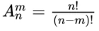
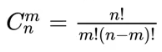
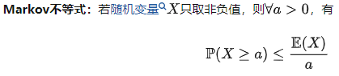
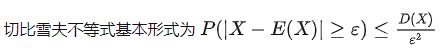

概率论    
  研究随机现象数量规矩的数学分支  

随机事件  
  可以相同条件下重复执行  
  事先知道可能出现的结果  
  实验开始前并不知道这一次的结果  

所有结果的集合是样本空间  

概率是频率趋于稳定的值  

古典概型  
实验e中样本点是有限的，出现每个样本点的概率是相同的  
P(A) = A所包含的样本点数/S中的样本点数  

条件概率  
样本空间发生变化  

独立性  
注意两两独立和相互独立  

独立实验  
重复独立实验  
n重伯努利实验  
  
  

二维随机变量  
二维随机变量随机函数：F（x， y）  
用联合分布函数F（x， y）表示矩形域概率  
  离散型随机变量  
  连续型随机变量：双重积分  
边缘分布函数：只看x，或只看y  
  离散型随机变量  
  连续型随机变量  

期望(均值)  
  一维、二维  

方差(数据偏差值)  

大数定理  
  在实验不变的条件下，重复实验多次，随机事件的频率近似于它的概率  

马尔可夫不等式  
  马尔可夫不等式把概率关联到数学期望，给出了随机变量的累积分布函数一个宽泛但仍有用的界。  
    
  马尔可夫不等式是用来估计尾部事件的。一个直观的例子就是如果X是工资，那么E(X)就是平均工资，假设a=n*E(X)，即平均工资的n倍。那么根据马尔可夫不等式，不超过1/n的人会有超过平均工资的n倍的工资。  
  从某种程度上，这也就是我们常说的“1%的人拥有99%的财富”  

由马尔可夫不等式证得切比雪夫不等式  
    

中心极限定理  
  样本的平均值约等于总体的平均值，不管总体是什么分布，任意一个总体的样本平均值都会围绕在总体的整体的平均值周围，并且呈正态分布  

最大后验概率  
  极大似然概率*先验知识  

贝叶斯  
  
