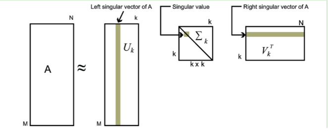

特征向量：方向，特征值：力度（重要程度）（越大越重要，将维一般保留特征值大的）  
特征空间包含所有特征向量  
特征向量应用：提取有价值的信息  
SVD矩阵分解：  
  将矩阵分解后保留完整信息，原始矩阵太大了（稀疏），没法做，将他拆分成局部矩阵  
  基变换  
  特征值分解  
  按照特征值大小进行筛选，一般钱10%的特征值的和就占到了99%，分解成M*K K*K K*N的局部矩阵  
  