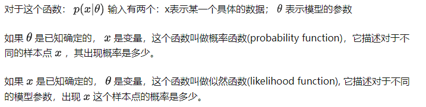

离散型随机变量  
  概率函数  
  概率分布  
  
连续型随机变量  
  概率密度  
  概率密度函数（定积分求面积）  

简单随机抽样  
  样本相互独立  
  样本分布与总体分布相同  
  联合分布函数（分布累乘）  
  联合概率密度（概率密度累乘）  

似然函数  
  概率表达了给定参数情况下样本的可能性  
  似然表达了给定样本的情况下参数的可能性  
  

极大似然估计  
  利用已知的样本结果信息，反推最具有可能（最大概率）导致这些样本结果出现的模型参数值！（求极值）  

  构造似然函数  
  取对数（单调递增）  
  求参数偏导（当切线斜率=0，取极大值）  
  得到最大似然估计参数值  
  