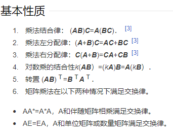

行列式  
  行列式计算方式为主对角线-副对角线  
  值  
  行列相等  
矩阵  
  数表  
  方阵  上三角阵  下三角阵  对角阵  单位矩阵  对称矩阵  
  同型矩阵：行列相等  
  矩阵相等：行列相等且值相等  
  加减法：对应元素相加减（前提：矩阵同型）  
  数乘：每一项乘以对应数  
  乘法：行乘列相加，结果为一个矩阵（所有元素）（A的列数和B的行数相等）
  内积：两个矩阵A、B对应分量乘积之和，结果为一个标量  
    
  方程组转换为矩阵运算  
  矩阵转置：行变列，列变行  
  逆矩阵  
  秩：矩阵的最大线性无关组（零向量必线性相关）（矩阵行秩=列秩）（矩阵旋转秩不变） 
向量
  向量长度：平方相加开根号  
  长度为一：单位向量  
  三角不等式：两边之和大于第三边  
  齐次性  
  向量的正交  
  规范正交基  

  
  